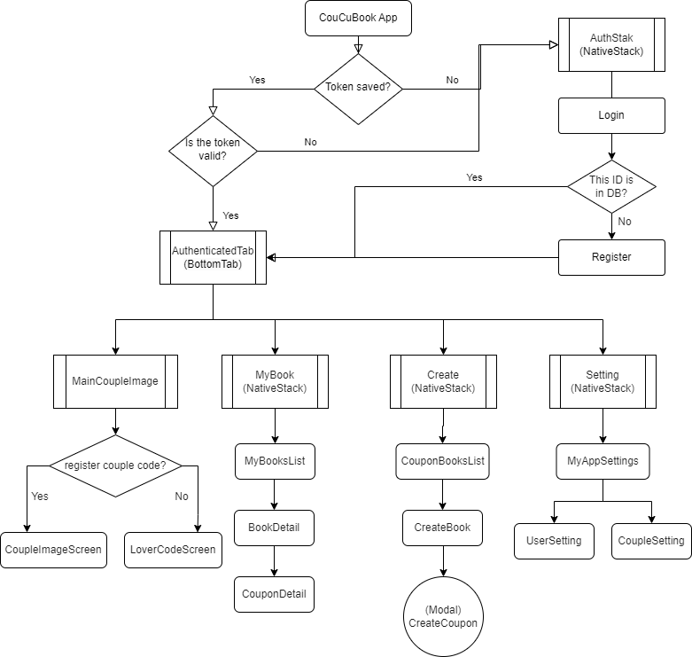
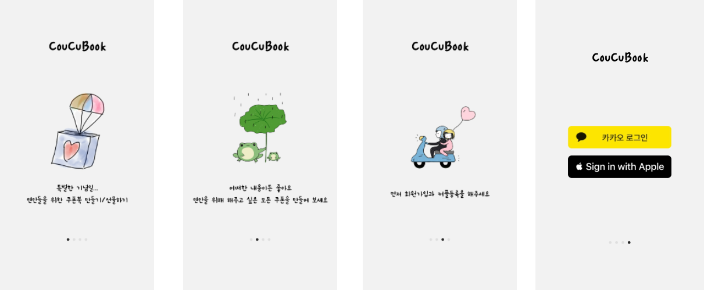
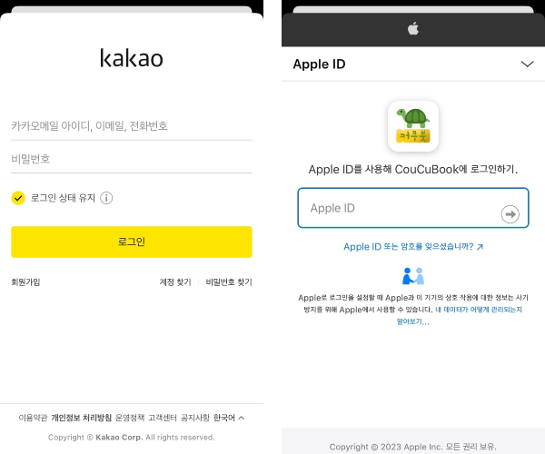
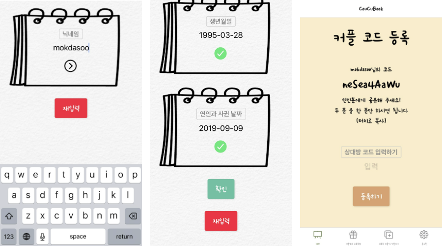
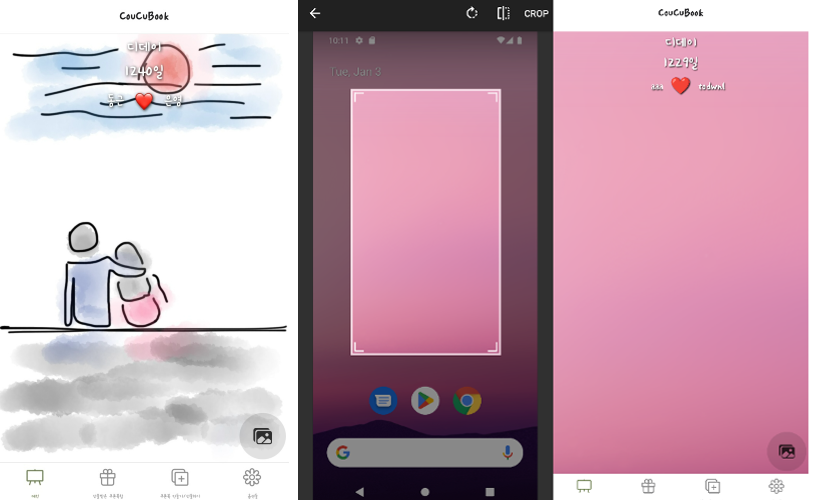
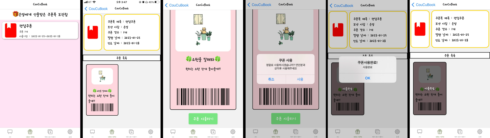
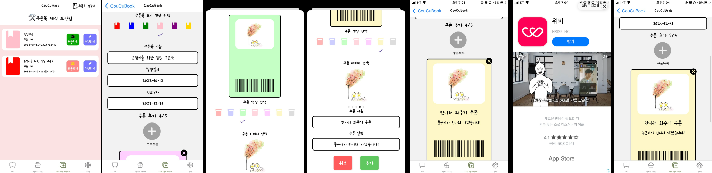
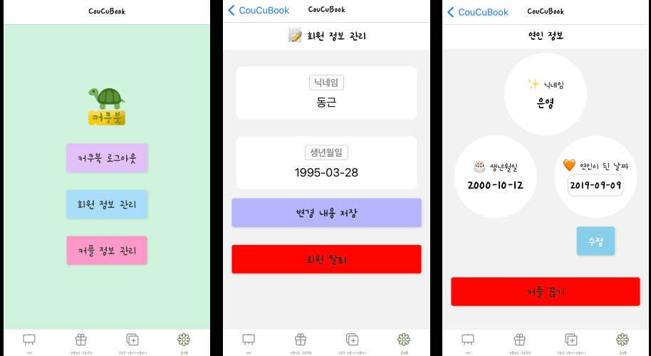

# CouCuBook 커쿠북
  

---
## Description

- React-Native, Typescript를 활용한 커플쿠폰북 앱 만들어 배포하기 개인 프로젝트  
- 상대방을 위해 직접 만들어 선물하는 커플 쿠폰북  
- 개발기간: 2022.12.21 ~ 2023.01.17  
- 개발환경: Expo managed workflow
- 맡은 역할: 1인 개발로 모든 과정(기획, 개발, 배포 등)

---

## 다운로드
구글 플레이 스토어 : <a href='https://play.google.com/store/apps/details?id=com.mokdasoo.coucubookapp'>링크</a>  

앱스토어 : <a href='https://apps.apple.com/us/app/coucubook-%EC%BB%A4%EC%BF%A0%EB%B6%81/id1666187593'>링크</a>  

---

## 기술
 

 

 
 
 

---
## 프로젝트 화면 구성

 

## 프로젝트 소개

 

- 앱의 첫 화면
- 로그인 화면
 

---

- 카카오, 애플 간편 로그인 기능
 

---

- 필수 정보 입력 화면
 

---

- 첫 번째 탭, 메인이미지 화면
- 사진 변경 시 사진은 서버에 저장되어 본인과 연인에게 동시 적용
- 기념일 날짜 계산하여 디데이 표시 
 

---

- 두 번째 탭, 선물받은 쿠폰북 보관함 화면
- 선물받은 쿠폰북들 리스트로 확인 가능
- 쿠폰북 누르면 쿠폰북 상세화면 으로 이동(쿠폰 목록들 볼 수 있음)
- 쿠폰 누르면 쿠폰 상세화면 으로 이동(쿠폰 사용 기능) 
 

---

- 세 번째 탭,  쿠폰북 제작 보관함 화면
- 제작한 쿠폰북들 리스트로 확인 가능, 쿠폰북 제작, 수정 삭제 기능
- 우측 상단 쿠폰북 만들기 누르면 쿠폰북 제작 화면 으로 이동
- 쿠폰북 정보 입력, 쿠폰들 추가 할 수 있음, 쿠폰 개수 더 늘리고 싶으면 광고 시청하면 리워드 5개씩 제공
- 선물하기 전인 쿠폰북은 저장하면 폰 로컬 내부에 저장됨, 선물 해야 서버 DB에 저장
 

---

- 네 번째 탭,  설정 화면
- 로그아웃 기능
- 회원 정보 수정, 회원 탈퇴 기능
- 커플 정보 수정, 인연 끊기 기능
 

---

##  <a href='https://pineapple-spatula-1be.notion.site/e530cfbe51ac45f38c2022e014409e43'>✍️ 기능 명세 </a>
##  <a href='https://dg-studio.gitbook.io/coucubook-api/'>💻 API </a>
