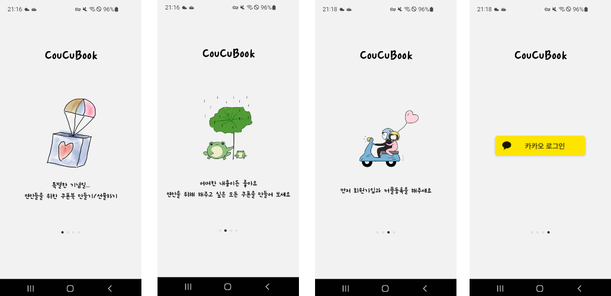
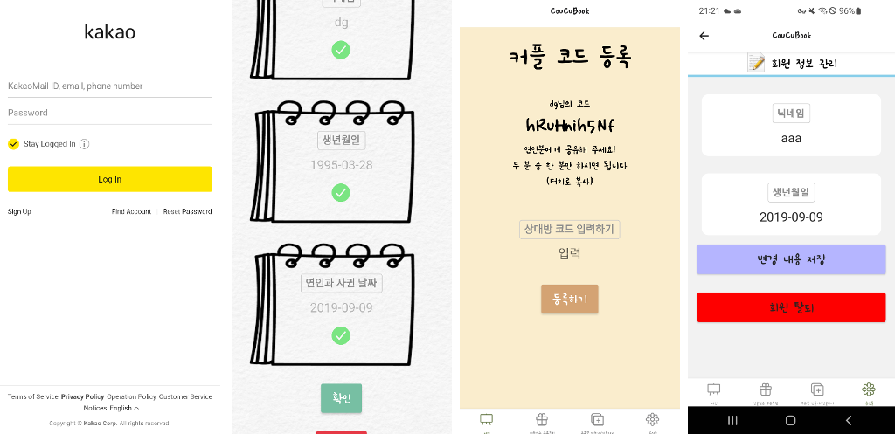
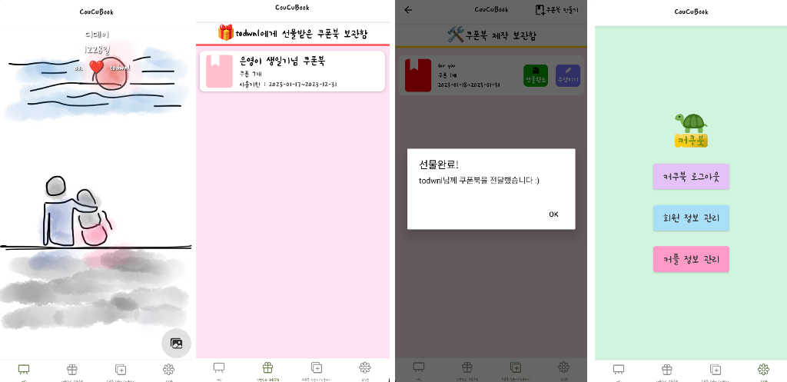
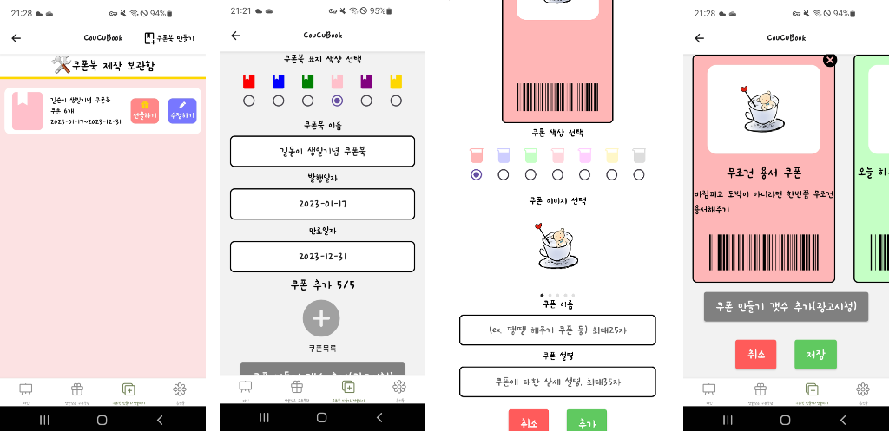
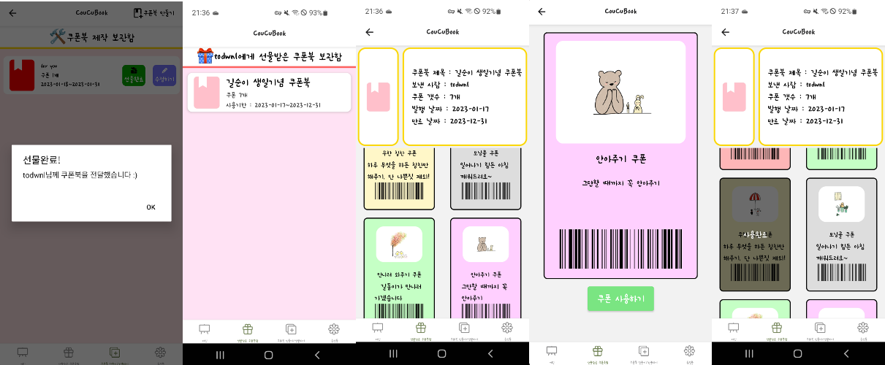
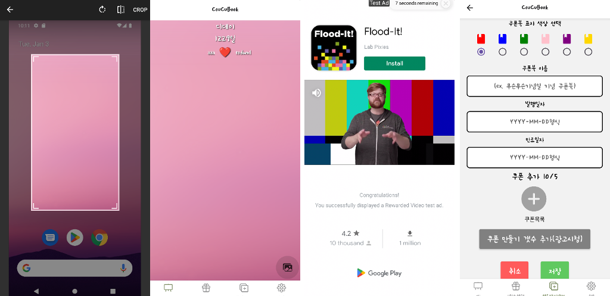

# CouCuBook
# React-native, typescript를 활용한 커플쿠폰북 앱 만들기 (expo 활용하여 android, ios 동시 개발)

- 프로젝트 명 : 커쿠북CouCuBook

- 프로젝트 내용 :  상대방을 위해 직접 만드는 커플 쿠폰북

- 프로젝트 기간 : 2022.12.21 ~ 2023.01.17

- skills : React-native(expo), 로컬DB(SQLite), 상태관리(Redux), typescript, Node.js(express로 백엔드 API 개발) 서버DB(MySQL)

- 프로젝트 기획:
    - 기능
        1. 간편 로그인(카카오, 네이버, 구글) ※특이사항: 상대방과 짝지어야됌 
        2. 사귄날,디데이 표시, 메인커플사진등록
        3. (상대방한테 만들어주는) 쿠폰북만들기 → 쿠폰만들기( 쿠폰은 만들때 특정비밀번호설정→ 상대방이 쿠폰쓸때 내가 비번 입력해줘야 사용됨 또는 큐알코드 이용해보기)
        4. 쿠폰북은 미완성 완성으로 나눌수있고 완성이면 상대방한테 선물하기로 전달, 미완성은 이어서 제작가능
        5. 알림표시기능(쿠폰북 선물, 쿠폰사용)
        6. 쿠폰북 클릭시 책펼쳐지는 화면전환효과 
        7. 쿠폰은 사용전 사용완료로 나눔

# CouCuBook
  

---
## Description

React-Native, Typescript를 활용한 커플쿠폰북 앱 만들기  
상대방을 위해 직접 만들어 선물하는 커플 쿠폰북  
개발기간: 2022.12.21 ~ 2023.01.17

---

## 배포
구글 플레이 스토어 : 검토중  
앱스토어 : 심사중

---

## 기술

 

 

 

 

 

---

## 프로젝트 스크린샷, 설명

 

### FlatList의 horizontal 속성을 활용한 carousal 기능을 사용해 로그인 Screen 구현 
 

---

 

- WebView + kakao REST API를 활용한 카카오 간편로그인 구현
- AsyncStorage 로 토큰 관리 access_token 만료시 refresh_token으로 재발급 로직 구현
- 추가 정보 입력창까지 입력해야 회원가입 완료
- 회원정보 수정, 탈퇴 기능 구현
- 회원가입이 완료된 유저는 메인스크린으로 이동, 단 커플코드가 등록안된 유저는 커플코드등록 스크린이 뜸

 

 

- 커플 등록시 메인커플이미지 화면이 뜨게 되고 이미지는 디폴트 이미지가 보여짐.
- 메인화면은 react navigation API reference 중 bottom-tabs Navigator로 4영역으로 나눔
    - 메인 커플 이미지 탭
    - 선물 받은 쿠폰북 보관함 탭
    - 쿠폰북을 제작하고 선물할 수 있는 쿠폰북 제작 탭
    - 설정 탭

 

 

- 쿠폰북 제작 탭입니다. 중첩 Navigator로 native-stack을 활용하여 화면간 이동을 구현했습니다.
    -  제작한 쿠폰북 보관함 -> 쿠폰북 만들기 스크린 -> 쿠폰북의 쿠폰 만들기 스크린
- 저장한 쿠폰북은 expo-sqlite라이브러리를 활용하여 기기 로컬에 저장하게 하였습니다.

 

 

- 쿠폰북 제작함에서 상대방한테 선물할때에야 서버DB에 저장이 됩니다. -> 유저가 선물안하는 많은 쿠폰북을 만들었을 때 불필요한 서버 DB자원 소비를 막기 위함.
- 선물받은 쿠폰북 보관함 -> 쿠폰북 상세 스크린 -> 쿠폰 상세 스크린 으로 구성되어 있습니다.
- 본인이 받은 쿠폰북들만 서버에서 받아오고 redux로 받아온 쿠폰북들을 관리 합니다.
- 쿠폰을 사용하게 되면 서버로 쿠폰을 사용했다고 보내고 redux로 관리하는 상태만 업데이트 해 사용완료로 바꿉니다.

 

 

- expo-image-picker를 활용하여 권한을 관리하고 이미지를 가져오고 그 이미지를 커플이미지로 업데이트합니다. 한명이 사진을 바꾸면 상대방 사진도 동일한 사진으로 변경됩니다.
- 쿠폰북을 만들 때 쿠폰을 여러개 만들 수 있는데 기본 5개에서 Google Admob 광고를 시청하면 5개씩 추가가 되게 만들어 수익성을 낼 수 있게 구현하였습니다.

 

---
